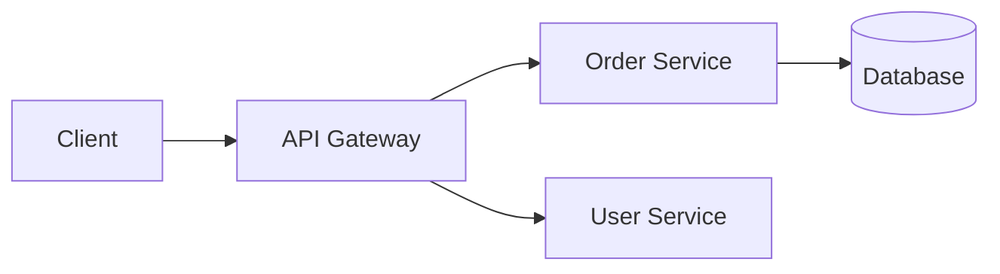

# Documentation Standards

These standards ensure our documentation is useful, maintainable, and discoverable. Good documentation reduces onboarding time, prevents knowledge silos, and improves code quality.

## Documentation Philosophy

1. **Audience First**: Write for your readers, not yourself
2. **Just Enough**: Document what's needed, not everything
3. **Keep Current**: Outdated docs are worse than no docs
4. **DRY Documentation**: Don't repeat what code already says
5. **Discoverable**: Easy to find and navigate

## Types of Documentation

### Code Documentation

#### Self-Documenting Code

```java
// ❌ Comment explains what (obvious from code)
// Increment counter by 1
counter++;

// ✅ Comment explains why (not obvious from code)
// Reset to start of circular buffer when reaching capacity
if (index >= buffer.length) {
    index = 0;
}
```

#### Method Documentation

```java
/**
 * Calculates the discounted price for an order.
 *
 * @param order the order to calculate discount for
 * @param discountPercent the discount percentage (0-100)
 * @return the discounted total price
 * @throws IllegalArgumentException if discount is negative or greater than 100
 */
public BigDecimal calculateDiscountedPrice(Order order, int discountPercent) {
    // implementation
}
```

#### When to Document Methods

✅ Public API methods
✅ Complex algorithms
✅ Non-obvious behavior
✅ Important side effects
✅ Thrown exceptions

❌ Getters/setters (unless unusual behavior)
❌ Overridden methods (inherit parent docs)
❌ Obvious implementations

### API Documentation

#### OpenAPI/Swagger

```yaml
/orders:
  post:
    summary: Create a new order
    description: |
      Creates a new order for the authenticated customer.
      The order will be in PENDING status until payment is confirmed.
    tags:
      - Orders
    requestBody:
      required: true
      content:
        application/json:
          schema:
            $ref: '#/components/schemas/CreateOrderRequest'
          example:
            customerId: "cust-123"
            items:
              - productId: "prod-456"
                quantity: 2
    responses:
      '201':
        description: Order created successfully
        content:
          application/json:
            schema:
              $ref: '#/components/schemas/Order'
      '400':
        description: Invalid request
      '401':
        description: Unauthorized
```

#### API Documentation Requirements

- All endpoints documented
- Request/response schemas defined
- Examples provided
- Error responses explained
- Authentication requirements stated

### README Documentation

#### Project README Structure

```markdown
# Project Name

Brief description of what this project does.

## Quick Start

Fastest way to get running.

## Prerequisites

What you need before starting.

## Installation

Step-by-step installation.

## Usage

How to use the project.

## Configuration

Environment variables and config options.

## Development

How to set up for development.

## Testing

How to run tests.

## Deployment

How to deploy.

## Contributing

How to contribute.

## License

License information.
```

#### Module README Structure

```markdown
# Module Name

What this module does.

## Responsibilities

What this module is responsible for.

## Key Components

Main classes/components.

## Dependencies

What this module depends on.

## Usage Examples

How to use this module.

## Memory Bank

Link to module context in Memory Bank.
```

### Architecture Documentation

#### Architecture Decision Records (ADRs)

See `adr-writer.agent.md` for ADR standards.

**Location**: `.memory-bank/decisions/`

#### Architecture Diagrams

- **Context Diagram**: System and external actors
- **Container Diagram**: High-level technical components
- **Component Diagram**: Components within containers
- **Code Diagram**: Class/module structure (sparingly)

Use **C4 Model** or similar notation.

### Operational Documentation

#### Runbooks

```markdown
# Runbook: [Service Name]

## Overview
What this service does.

## Health Checks
How to verify the service is healthy.

## Common Issues

### Issue: High CPU Usage
**Symptoms**: CPU > 80% for extended period
**Diagnosis**: Check for tight loops, inefficient queries
**Resolution**: Scale up, optimize code

### Issue: Database Connection Pool Exhausted
**Symptoms**: Connection timeout errors
**Diagnosis**: Check active connections, slow queries
**Resolution**: Increase pool size, kill long queries

## Deployment
How to deploy.

## Rollback
How to rollback.

## Contacts
Who to contact for issues.
```

## Writing Style

### General Guidelines

1. **Use Active Voice**: "The service validates input" not "Input is validated"
2. **Be Concise**: Remove unnecessary words
3. **Use Present Tense**: "Returns the user" not "Will return the user"
4. **Be Specific**: Avoid vague terms like "handles" or "manages"
5. **Use Examples**: Show, don't just tell

### Technical Writing Tips

```markdown
❌ Vague
The system handles errors appropriately.

✅ Specific
The system logs errors with full stack traces and returns a 500 status code
with a correlation ID for debugging.
```

```markdown
❌ Passive
The configuration is loaded by the service.

✅ Active
The service loads configuration from environment variables.
```

### Code Examples in Documentation

- **Complete**: Examples should work if copied
- **Minimal**: Show only what's necessary
- **Annotated**: Explain non-obvious parts
- **Tested**: Verify examples work

## Documentation Locations

| Type | Location | Format |
|------|----------|--------|
| Code docs | In source files | Javadoc/XMLDoc/JSDoc |
| API docs | `/docs/api/` | OpenAPI YAML |
| README | Root and module dirs | Markdown |
| ADRs | `.memory-bank/decisions/` | Markdown |
| Module context | `.memory-bank/modules/` | Markdown |
| Knowledge base | `.memory-bank/knowledge/` | Markdown |
| Runbooks | `/docs/runbooks/` | Markdown |

## Documentation Maintenance

### Review Triggers

Update documentation when:
- Code behavior changes
- API contracts change
- Configuration changes
- Architecture changes
- Deployment process changes

### Freshness Indicators

Include update dates:
```markdown
> Last Updated: 2024-01-27
> Reviewed by: @developer
```

### Documentation Debt

Track documentation debt:
- Missing docs for public APIs
- Outdated architecture diagrams
- Stale runbooks
- Incomplete READMEs

## Diagrams and Visuals

### When to Use Diagrams

✅ Architecture overview
✅ Complex workflows
✅ Data flow
✅ State machines
✅ Deployment topology

### Diagram Standards

- Use consistent notation (C4, UML)
- Include legends
- Keep diagrams simple
- Version control diagram sources
- Use tools that support version control (Mermaid, PlantUML)

### Mermaid Examples

```markdown

```

## Memory Bank Integration

### Project Context
- High-level architecture
- Tech stack
- Team conventions

### Module Context
- Module responsibilities
- Key components
- Dependencies

### Knowledge Base
- Patterns and best practices
- Troubleshooting guides
- Lessons learned

### Decisions
- Architecture decisions (ADRs)
- Rationale and alternatives

## Documentation Checklist

### New Feature

- [ ] README updated if needed
- [ ] API documentation added
- [ ] Code comments for complex logic
- [ ] Module context updated
- [ ] Examples provided

### API Change

- [ ] OpenAPI spec updated
- [ ] Breaking changes documented
- [ ] Migration guide provided
- [ ] Changelog updated

### Architecture Change

- [ ] ADR created
- [ ] Diagrams updated
- [ ] Module contexts updated
- [ ] Runbooks updated
